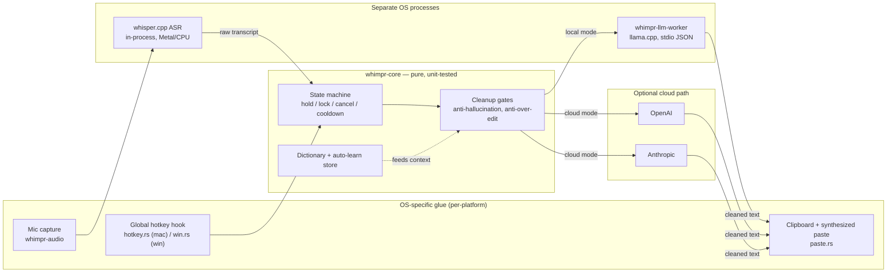

# WhimprFlow — Technical Audit

Source: `github.com/Kartik281204/Whimper-Flow`, `main` @ `aae0287` (cloned and reviewed directly — not going off the README alone).
Size: ~5,247 lines Rust across 7 crates + the Tauri shell, ~2,631 lines TypeScript/TSX.

**Method note:** this is a static read of the source, docs, and config — I didn't compile or run the app (it needs macOS/Windows-native toolchains, CoreGraphics/objc2 frameworks, and Accessibility/mic permissions my sandbox doesn't have). Findings about *what the code does* are grounded in the actual files cited below. Findings about *runtime behavior under load* (crashes, races) are inference from the code, not observed failures — flagged as such where it matters.

---

## 1. What this project is

A local-first, cross-platform voice-dictation app: hold a key, speak, and cleaned-up text lands wherever your cursor is. It's an independent, from-scratch reimplementation of the Wispr Flow workflow — own name, own code, no shared assets.

Pipeline: global hotkey → mic capture → on-device Whisper ASR (`whisper.cpp` via `whisper-rs`, Metal on macOS) → an LLM cleanup pass (local Qwen via `llama.cpp` in a separate worker process, or optional cloud OpenAI/Anthropic) that strips fillers, resolves spoken self-corrections, and adds punctuation/formatting → clipboard-paste into whatever app is focused.

macOS is the reference platform (built, tested, working end-to-end on Apple Silicon). Windows compiles and runs the same core loop on real hardware (MSVC), with several features still macOS-only (auto-learn, GPU acceleration for local inference).

This is **not** a toy CRUD app. It's systems-level software: a global OS keyboard hook, real-time audio capture, on-device ML inference, cross-process IPC, and OS-level text injection, on two platforms. The `docs/SPEC.md` and `docs/ARCHITECTURE-DUAL-PLATFORM.md` files show real research behind it (a phased build order M0–M9, a 12-item risk register with mitigations, several hundred sources consulted) — closer to a planned systems project than the README's modest "vibe-coded in a few hours" framing suggests.

## 2. Architecture as shipped

Tauri v2: a Rust core with React/TypeScript webviews (Hub window + a small always-on-top overlay "pill"). The good architectural call already made: platform-agnostic logic is isolated in `crates/whimpr-core` (state machine, cleanup gates, dictionary, settings, stats — all pure and unit-tested), while OS glue lives in `src-tauri/hotkey.rs` (macOS) and `src-tauri/win.rs` (Windows). ASR and the local LLM run as **separate processes** from the main app specifically to avoid a native symbol clash between `whisper.cpp` and `llama.cpp` — a non-obvious constraint that's handled correctly.



A dedicated `whimpr-ipc` crate defines the sidecar wire protocol (length-prefixed JSON over stdio), and `whimpr-sidecar` is a standalone Fn-key detector binary — the seam for eventually moving the hotkey hook itself out of the main process (see §4.1).

## 3. What's genuinely good here

This matters as much as the problems — a lot of the "senior engineering" boxes are already checked:

- **Real seams, not just folders.** `AsrEngine` and `CleanupProvider` are actual traits, so swapping Whisper for Parakeet later, or adding a third cleanup provider, doesn't touch `whimpr-core`. This is the textbook reason to use traits, applied correctly rather than decoratively.
- **Deterministic safety net on top of the LLM.** `whimpr-core/cleanup/gates.rs` checks novelty ratio, lost-entity detection, over-deletion, hallucination, and banned assistant-reply prefixes before trusting the LLM's rewrite, falling back to the raw transcript if any gate fires. Most side projects that bolt an LLM onto a pipeline skip exactly this step; here it's specced, implemented, and tested.
- **Secrets handled correctly.** API keys go to the OS keychain (macOS Keychain / Windows Credential Manager), never to a file — confirmed in code, not just claimed in the README. `.gitignore` explicitly calls out never committing `.env`/`.pem` files.
- **Tests exist on the highest-risk pure logic.** State machine, cleanup gates, IPC codec (round-trip, multi-frame, oversize-rejection), dictionary matching, settings persistence, and audio resampling all have unit tests — more coverage than `docs/BUILD-STATUS.md` even credits (it undercounts by leaving out `whimpr-audio` and `src-tauri/autolearn.rs`, which also have tests).
- **TypeScript strict mode, actually strict.** `noUnusedLocals`, `noUnusedParameters`, `noFallthroughCasesInSwitch` are all on, not just `"strict": true` and calling it done.
- **The API-key UI is done right**: password-masked input, explicit save action, "configured / not set" status rather than ever echoing the key back.

## 4. Bugs & technical debt

### 4.1 The one that matters most: a panic here can take down the whole app

`src-tauri/src/hotkey.rs` and `src-tauri/src/win.rs` together account for **38 of the repo's 51 `.unwrap()` calls** — concentrated in exactly the two files that run on every keystroke of the global hook.

The sharper problem: `tap_callback` in `hotkey.rs` is an `extern "C"` function pointer, registered directly with `CGEventTapCreate` and invoked by macOS on every flags-changed event. It calls `.lock().unwrap()` directly at line 575:

```rust
*TARGET_APP.get_or_init(|| Mutex::new(None)).lock().unwrap() = target;
```

That same `Mutex` is also locked (and unwrapped) elsewhere, e.g. in `record_dictation`. A `Mutex::lock()` only panics if the mutex is *poisoned* — i.e., some other thread already panicked while holding it. Today nothing appears to trigger that. But if anything anywhere in this shared state ever does panic while holding one of these locks, the **next** key press panics inside an `extern "C"` callback — and modern Rust turns an unwind across that FFI boundary into a hard process abort, not a caught error. The entire app disappears mid-dictation, with nothing in the (currently `eprintln!`-only, invisible-in-a-bundled-app) logs to explain why.

Windows has the same shape of risk in `win.rs` (16 unwraps), compounded by something the team's *own* risk register already flags as high severity: `docs/ARCHITECTURE-DUAL-PLATFORM.md` §Risk register, **R1**, notes that a `WH_KEYBOARD_LL` hook that stalls past ~1000ms is *silently* unregistered by Windows with no notification — and the documented mitigation is to move the hook into the isolated `whimpr-sidecar` process so heavy inference can't starve it. Per `docs/BUILD-STATUS.md`, that move ("M1 sidecar isolation") **hasn't happened yet** — the hook still runs in-process, sharing a thread pool with Whisper/LLM inference. This is the single most product-critical latent bug in the repo: under real load, on Windows, the hotkey can silently stop working with zero error shown to the user, and you already correctly identified the fix before I did.

### 4.2 Docs vs. code have drifted apart (three separate cases)

1. `docs/BUILD-STATUS.md` (dated 2026-07-17) says `CleanupMode::Local` is "stubbed (pastes raw)." The actual code disagrees: `local_llm.rs` implements a real subprocess worker over stdio JSON, and `CleanupMode::Local` is wired to it in both `hotkey.rs:374` and `win.rs:200`. The feature is done; the status doc undersells it.
2. Model naming disagrees between docs: the README says local cleanup runs "Qwen3-4B-Instruct"; `BUILD-STATUS.md` says "Qwen2.5-1.5B." The code (`local_llm.rs::model_path`) actually prefers Qwen3-4B if present and falls back to Qwen2.5-1.5B — both docs are half-right.
3. `docs/SPEC.md` was written for a **native Swift**, in-process-`llama.cpp` architecture. The shipped app is Tauri with the LLM in an isolated sidecar process — a good pivot (cross-platform reach, avoids the symbol clash), but the primary spec doc never says the pivot happened, so it reads as the plan rather than a record of what changed and why.

None of this is a code problem, but for a repo that's meant to survive a technical review, docs that actively understate or contradict the implementation are a bigger credibility risk than most of the actual bugs below — a reviewer who spot-checks one claim against the code and finds it wrong will trust the rest of the audit less, fairly or not.

### 4.3 Smaller, concrete correctness bugs

- **Silent data loss in `paste.rs`.** The clipboard save/restore around the synthesized paste only saves *text*: `cb.get_text().ok()`. If the user's clipboard held a non-text item (an image, a file reference) when they dictate, `saved` is `None`, the restore branch never runs, and that clipboard content is gone for good — replaced by whatever the target app leaves after consuming the paste. Small, easy to reproduce, currently undocumented.
- **Fixed-sleep synchronization**, same file: `sleep(60ms)` before the synthesized Cmd+V, `sleep(150ms)` after, instead of any completion signal. Works most of the time; is exactly the kind of timing assumption that flakes under system load on a machine other than the one it was tuned on.
- **Errors vanish on the frontend.** Every function in `ui/src/hub/api.ts` (`getSettings`, `setSettings`, `setApiKey`, all of them) wraps the Tauri `invoke` call in `try { } catch { /* no-op */ }`. The `catch` exists for a real reason — the Hub is designed to still render in a plain browser during `vite` dev, where `invoke` throws — but it applies the same silence to a genuine backend failure in the shipped app. Save your OpenAI key and have it silently fail, and the UI gives no indication either way.
- **Inconsistent save feedback in Settings.** API-key fields show "Saved to keychain ✓"; the cleanup-mode/level toggles and the sound switch auto-save through the same `onChange → setSettings` path with no confirmation at all. A user has no way to tell those actually persisted.

### 4.4 Process and tooling gaps

- **No CI.** No `.github/workflows` at all — nothing runs `cargo test`, `cargo clippy`, or `tsc --noEmit` on push. Given the doc-drift findings above, CI running `cargo test` + a doc/status check would have caught at least one of them automatically.
- **No linting.** No ESLint or Prettier config anywhere in the repo, despite a strict `tsconfig.json` otherwise. `tsc --noEmit` catches type errors, not style or common React footguns.
- **Zero frontend test tooling.** `ui/package.json` has no test runner (no Vitest, no Jest, no React Testing Library) — test coverage today is 100% backend (Rust), 0% frontend (TS/TSX).
- **No end-to-end test of the actual pipeline.** The unit tests are all on isolated pure logic (state machine, gates, codec). Nothing exercises hold-key → mock ASR → cleanup → paste as one path.
- **`tracing` is a declared dependency that's never used.** `Cargo.toml` pulls in `tracing = "0.1"` at the workspace level, and both `whimpr-core` and `src-tauri` list it — but `grep -rn "tracing::"` across the whole repo returns zero hits, versus 50 `eprintln!` calls. `eprintln!` is invisible once this ships as a bundled GUI app with no attached console, which is exactly when you'd want a log to diagnose the silent-hook-death scenario in §4.1. The dependency is already there; it's just not wired up.
- **Git history is three commits**, two of them "Add files via upload." Not a code defect, but a reviewer who opens the commit log to understand how this was built learns nothing from it — worth knowing if you want the repo itself (not just the running app) to read as evidence of process.

## 5. Security review

This app's actual attack surface is unusual for a portfolio project — it's not a web app with a database, it's a native process with **Accessibility (global keystroke read + injection), microphone access, and JIT/unsigned-executable-memory entitlements**, unsandboxed by necessity (`Entitlements.plist` documents why — CGEventTap and Accessibility require it). That's a large, *legitimately* necessary privilege footprint for what the app does. It also means the bar for anything that could execute arbitrary code inside the webview is much higher-stakes here than in a typical desktop app.

- **`tauri.conf.json` sets `"csp": null`** — the webview's Content Security Policy is fully disabled. Given the privilege footprint above, this is the single highest-leverage security fix available, and one of the cheapest: a working CSP (`default-src 'self'`, explicit exceptions only where needed) closes off script-injection as a path to that native surface, for a few hours of work.
- **A personal Apple Developer signing identity (name + email) is hardcoded in `tauri.conf.json`.** Not a vulnerability, but it's committed PII in a public repo, and it means the build breaks for anyone else who clones it (including you, on a different machine) until they edit that file back out. Worth moving to an environment variable or a gitignored local override — the `.gitignore` already shows the right instinct for secrets, this just isn't covered by it.
- **No signing/notarization pipeline yet** (self-disclosed in the README). Beyond the dev friction, the team's own risk register (**R2**) already correctly flags that a global-keyboard-hook-plus-clipboard-automation app is exactly shaped like a keylogger to Defender/SmartScreen heuristics, and that a fresh signing identity has zero reputation. The mitigation (sign both the app and the sidecar binary, pre-submit to Microsoft for allowlisting) is already scoped — just not built.
- **What's already right:** keys in the OS keychain rather than a file (verified in code, not just claimed), password-masked key entry in the UI, IPC between the shell and the sidecar/worker is process-local stdio (no network exposure, with oversize-frame rejection already tested), and Tauri v2's capability system is scoped to the actual default permission set rather than something broad.

## 6. Cross-hardware reliability ("scalability" for a desktop app)

There's no server here, so scalability means "does this hold up across the hardware a real user has," not concurrent users:

- The team's own risk register (**R3**) already flags that Qwen-4B on Windows CPU/iGPU can blow the perceived-latency budget (5–7s instead of the ~300–500ms target) on weaker machines, with a tiered-model-selection mitigation planned but not yet built. This is the biggest "will it actually feel fast" risk, and it's already correctly identified — just not implemented.
- The fixed-sleep timing in `paste.rs` (§4.3) is a small instance of the same class of problem: tuned on one machine, not adaptive to a slower one.
- No crash or error reporting exists anywhere. For a background utility whose entire value proposition is "invisible until you need it," there's currently no way to find out it silently died on a real user's machine (ties directly back to §4.1 and the unused `tracing` dependency in §4.4).

## 7. UI/UX review

Based on the actual component code in `ui/src/hub/` — this isn't a guess from the README:

- The design-token system (`theme.ts`, `tokens/values.ts` — "Deep-Slate / Aqua-Whimpr") is coherent and used consistently across `SettingsPane`, `Home`, `Insights`, `DictionaryPane`. Good bones for a v0.1.
- Every component styles with inline `style={{...}}` objects — no CSS modules, Tailwind, or shared component library beyond a small local `ui.tsx`. Fine at the current size (8 Hub screens); will mean duplicated style objects as the Hub grows, since there's no single source of truth for e.g. what a "card" or "muted label" looks like beyond copy-pasting the object.
- Save-feedback inconsistency and silent-failure-on-error are covered in §4.3 — worth repeating here because they're UX bugs as much as code bugs: right now, this app cannot tell its own user when something went wrong.
- No system-appearance (light/dark) awareness apparent in `theme.ts` — reasonable for a v0.1 with one fixed dark theme, but worth deciding deliberately rather than by omission if this goes further.
- The onboarding (`Onboarding.tsx`) and permission-status UI (`SettingsPane`'s `PermRow`) are genuinely good patterns — sequenced, clear grant/not-granted state, explains *why* each permission matters in the copy itself rather than just naming it.

## 8. What I didn't verify

To be upfront about the edges of this audit: I read the source, config, and docs directly, but I did not compile the project (needs macOS/Windows toolchains and native frameworks unavailable in my Linux sandbox), did not run `cargo test` to confirm the "19/24+ green" claim myself, did not run `cargo clippy` (likely to surface additional lint-level issues beyond what's above), and did not exercise the actual hold-key → transcribe → paste loop. Everything above is what the code and docs say, cross-checked against each other — worth a quick `cargo test && cargo clippy` pass yourself before trusting the counts precisely.
