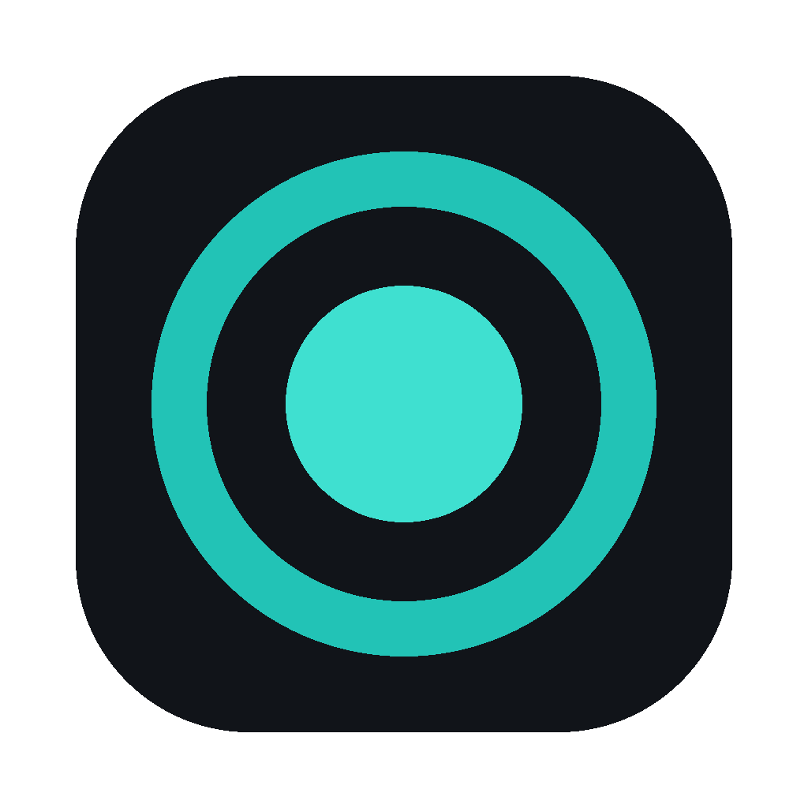

<div align="center">


# WhimprFlow

**Hold a key, speak, and clean text lands wherever your cursor is.**
A local-first, cross-platform voice dictation app — on-device speech recognition, LLM-cleaned transcripts, zero cloud dependency by default.

[](https://www.rust-lang.org/)
[](https://tauri.app/)
[](https://react.dev/)
[](https://www.typescriptlang.org/)
[](#platform-status)
[](#platform-status)
[](LICENSE)

[What's in it](#whats-in-it) · [Architecture](#architecture) · [Build it](#build-macos) · [Status](#current-status)

</div>

> ⚠️ **Proof of concept, built fast.** The core dictation loop is real and working end-to-end on both platforms — this isn't a mockup. But it's under-tested, missing an installer/signing pipeline, and has rough edges documented honestly in [Current Status](#current-status) below. Treat it as a serious starting point, not a finished product.

---

## Platform status

| Platform | Status |
|---|---|
| **macOS 14+** | **Built and working** — developed and tested locally (Apple Silicon, Metal GPU for ASR). |
| **Windows 10/11** | **Built and working** — compiles and runs on real Windows 11 (MSVC). Push-to-talk (hold **Right Ctrl**), Whisper ASR, clipboard + `SendInput` paste, and cloud cleanup (OpenAI or any OpenAI-compatible endpoint, e.g. OpenRouter) verified end-to-end. Auto-learn dictionary capture is still macOS-only; local LLM cleanup builds but is CPU-only for now (no CUDA/Vulkan yet). |

Both platforms are build-from-source only — no signed installer or release pipeline yet, so `git clone` + the steps below is the way to run it.

## What's in it

- **On-device ASR** — Whisper via `whisper.cpp`, running on GPU (Metal on macOS). Ships a small English model by default; larger models are auto-preferred if present.
- **Local LLM cleanup** — Qwen3-4B-Instruct via `llama.cpp`, spawned as a separate worker process specifically so `llama.cpp` and `whisper.cpp` never link into the same binary. Cleans transcripts: strips fillers, resolves spoken self-corrections ("meet at 2… no wait, 3" → "3"), applies spoken punctuation, formats lists and paragraphs — guarded by deterministic gates (novelty ratio, lost-entity, over-deletion, hallucination checks) that fall back to the raw transcript rather than risk a bad edit.
- **Optional cloud cleanup** — OpenAI (default) or Anthropic, behind one shared trait. Keys live in the OS keychain (macOS Keychain / Windows Credential Manager) — never written to disk in plaintext.
- **Floating pill UI** — a small always-on-top overlay cycling through idle, recording, transcribing, and done states, with a live RMS waveform while you talk.
- **Personal dictionary + auto-learn** — teach it names and terms manually; on macOS, an Accessibility observer watches for a one-word post-paste correction and learns it automatically, filtered conservatively to avoid learning junk. *(Auto-learn capture is macOS-only so far.)*
- **Local usage stats** — words dictated, words per minute, day streak, time saved, 7-day activity — all computed and stored on-device.

## Architecture

Tauri v2: a shared Rust core plus React/TypeScript webviews, split into 7 crates by responsibility rather than one monolithic binary:

```
crates/
  whimpr-core/          state machine, cleanup (prompts/gates/levels), dictionary, stats, settings
  whimpr-ipc/            the sidecar wire protocol (length-prefixed JSON codec)
  whimpr-audio/          mic capture (cpal) + resampling to 16kHz
  whimpr-asr/             Whisper ASR (whisper.cpp / whisper-rs, Metal-accelerated)
  whimpr-cleanup/         OpenAI / Anthropic cloud cleanup providers
  whimpr-llm-worker/     local llama.cpp cleanup worker (separate process)
  whimpr-sidecar/         standalone native-hook process (hotkey detection)
src-tauri/               Tauri shell: tray, overlay window, hotkey.rs (macOS) / win.rs (Windows),
                           paste.rs (clipboard + synthesized keystroke insertion), autolearn.rs
ui/                        React: overlay Flow Bar (ui/src/overlay) + Hub settings app (ui/src/hub)
docs/                     build spec, dual-platform architecture notes, 24 research documents
                           covering specific engineering decisions (ASR engine choice, sidecar vs.
                           in-process hooks, Tauri vs. Electron, per-platform hotkey handling)
```

The core design principle: platform-agnostic logic (the dictation state machine, cleanup gates, dictionary, stats) lives once in `whimpr-core` and is shared by both OS builds. Only the genuinely platform-specific pieces — the global hotkey hook, text injection, and window chrome — fork per OS (`hotkey.rs` on macOS, `win.rs` on Windows).

## Engineering depth

A few things that separate this from a weekend hack, worth calling out directly:

- **A real state machine, not ad-hoc event handling.** The dictation loop — hold-to-talk, double-tap-to-lock hands-free, lone-tap no-op, `Esc` to cancel, a 20-minute session cap with a 19-minute warning, debounced cooldown — is implemented as a pure `step(input) -> Vec<Action>` reducer in `whimpr-core`, not scattered across UI event handlers.
- **Deterministic safety gates on LLM output.** Before an LLM-cleaned transcript is pasted, it passes gates checking novelty ratio, lost entities, over-deletion, and hallucination — any of which trips a fallback to the raw, unedited transcript. The model is trusted to clean text, not to decide unilaterally that a bad edit is fine.
- **37 `#[test]`-annotated unit tests** across the Rust workspace (counted directly from source — see `crates/*/src/**/*.rs`), covering the IPC wire protocol, the state machine, the cleanup gates, and the dictionary prefilter.
- **Decisions are written down, not just made.** `docs/SPEC.md`, `docs/ARCHITECTURE-DUAL-PLATFORM.md`, and 24 files under `docs/research/` document the reasoning behind specific calls — why Tauri over Electron, why a separate sidecar process for native hooks instead of in-process, why the local LLM runs as its own worker process. Engineering trade-offs are traceable, not just asserted.

## Tech stack

| Layer | Choice |
|---|---|
| Shell | Tauri v2 (Rust core + system webview) |
| UI | React 18, TypeScript 5.7, Vite 5 |
| ASR | `whisper.cpp` (via `whisper-rs`), Metal GPU on macOS |
| Local LLM cleanup | Qwen3-4B-Instruct via `llama.cpp`, separate worker process |
| Cloud cleanup (optional) | OpenAI / Anthropic, or any OpenAI-compatible endpoint |
| Audio capture | `cpal` (cross-platform), linear resample to 16kHz |
| Secrets | OS keychain via the `keyring` crate — never a plaintext file |
| Windows native layer | `windows-rs` (`WH_KEYBOARD_LL` hook, `SendInput`, foreground-process detection) |
| macOS native layer | `objc2` / `objc2-app-kit` (Accessibility API, `NSWorkspace`) |

## Build (macOS)

Requires Rust (stable), Node + pnpm, and the Xcode command-line tools.

```bash
cd ui && pnpm install && cd ..
./dev.sh                                              # dev, hot reload
ui/node_modules/.bin/tauri build --bundles app        # signed .app bundle
```

Models are **not** committed (multi-GB). Place them under
`~/Library/Application Support/WhimprFlow/models/` — a Whisper `ggml-*.en.bin`
and a Qwen GGUF for local cleanup.

## Build (Windows)

Requires Rust (stable, MSVC toolchain), [CMake](https://cmake.org/download/), LLVM/clang (for `bindgen` — set `LIBCLANG_PATH` if not auto-detected), the Visual Studio Build Tools (Desktop development with C++), and Node + pnpm.

```powershell
cd ui; pnpm install; cd ..
ui\node_modules\.bin\tauri.CMD dev      # dev, hot reload
ui\node_modules\.bin\tauri.CMD build    # release build
```

Place models under `%APPDATA%\WhimprFlow\models\` — a Whisper `ggml-*.en.bin` (e.g. `ggml-base.en.bin` from [huggingface.co/ggerganov/whisper.cpp](https://huggingface.co/ggerganov/whisper.cpp)) and, optionally, a Qwen GGUF for offline cleanup. No local model? Set Cleanup Engine to **OpenAI** in the Hub's Settings pane and point the base URL at any OpenAI-compatible API — e.g. `https://openrouter.ai/api/v1` with an [OpenRouter](https://openrouter.ai) key.

Push-to-talk defaults to **Right Ctrl** (hold to record, release to paste) — the Windows analogue of a `Ctrl+Win`-style default. A configurable hotkey is planned but not wired up yet. The Windows GPU backend for Whisper/llama.cpp is CPU-only for now (macOS uses Metal); CUDA/Vulkan feature flags can be added in `crates/whimpr-asr/Cargo.toml` and `crates/whimpr-llm-worker/Cargo.toml`.

## Current status

Tracking what's real vs. planned, as of this write-up — see [`docs/BUILD-STATUS.md`](docs/BUILD-STATUS.md) for the full detail.

**Working end-to-end on macOS:** hold-hotkey → mic capture → Whisper (Metal) → cleanup (per settings) → safety gates → clipboard paste into the frontmost app, with the clipboard saved and restored. Each stage is validated independently, and the full loop is validated together.

**Working on Windows:** the same loop, minus GPU acceleration for ASR/LLM (CPU-only today) and minus auto-learn dictionary capture (macOS-only so far).

**Built but not yet wired up:**
- The local LLM worker process itself — spawning `llama.cpp` as a subprocess and talking to it over a JSON/stdio protocol — is implemented (`src-tauri/src/local_llm.rs`). It isn't yet called from the main cleanup dispatch, so selecting "Local" cleanup mode currently pastes the raw transcript rather than routing through it. This is next.

**Not yet built:**
- Native hook + text injection currently run in-process; moving them into the dedicated `whimpr-sidecar` process (the architecture the crate is scaffolded for) is pending.
- Permissions-onboarding UI, a CI runner, and notarization/signing pipelines for both platforms.
- A configurable hotkey (currently hardcoded per platform), UIA-based text insertion on Windows beyond clipboard paste, and secure-input/elevated-window guards.
- Dictionary auto-learn, history persistence, and command mode on Windows.

## Notes & disclaimers

- **Not affiliated with, endorsed by, or connected to Wispr Flow or any other product.** WhimprFlow is an independent, from-scratch reimplementation of the dictation workflow, with its own name, branding, colors, strings, and code. No third-party code or assets are included.
- **Proof of concept.** Built fast, under-tested in places, and missing pieces documented above. Contributions and fixes welcome.
- **Privacy.** ASR and default cleanup run entirely on-device. Cloud cleanup is opt-in and sends only the transcript (never audio) to the provider you choose. API keys never touch disk in plaintext.

## Contributing

Issues and PRs welcome, especially against the "not yet built" list above. `cargo test --workspace` before opening one.

## License

MIT — see [LICENSE](LICENSE).

---

<div align="center">

**Kartik Singh** — [GitHub](https://github.com/Kartik281204) · [LinkedIn](https://linkedin.com/in/kartiksingh28)

</div>
